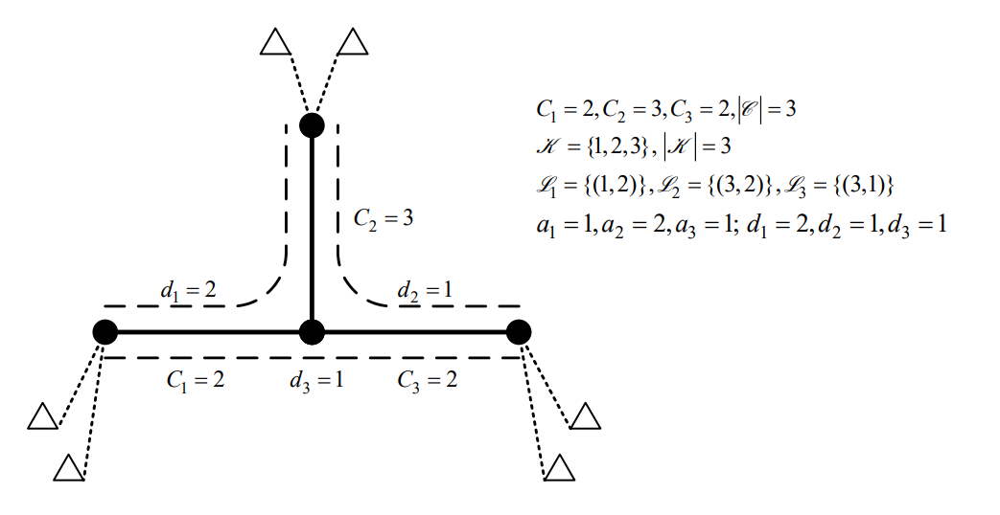
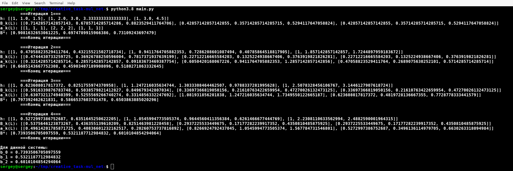

# Творческое задание

## Формулировка

Имеется некоторая заданная сеть. Требуется по ней рассчитать вероятность блокировки k-го класса соединений.

## Топология сети



## Решение

Зададим параметры в конфигурационном файле модели:

```toml
# все данные вводятся с индексом (начало 0)
[model]
L = [0, 1, 2] # множество звеньев сети
L_k = [[0, 1], [1, 2], [0, 2]] # маршрут для соединений k-класса
K = [0, 1, 2] # множество классов соединений
K_l = [[0, 2], [0, 1], [1, 2]] # множество классов соединений, маршруты которых проходят через l-звено
C = [2, 3, 2] # емкости звеньев
a = [1, 2, 1] # предложенная нагрузка соединений
d = [2, 1, 1] # требование к емкости всех звеньев маршрута соединения k-класса
[solver]
accuracy = 0.1
debug_info = true
```

Запустим программу: 

```bash
python3.8 main.py
```

Вывод программы: 



Значения $B^*_k$:

$B^*_0 = 0.7393506705097559$

$B^*_1 = 0.5321187712984832$

$B^*_2 = 0.6010104854294064$
